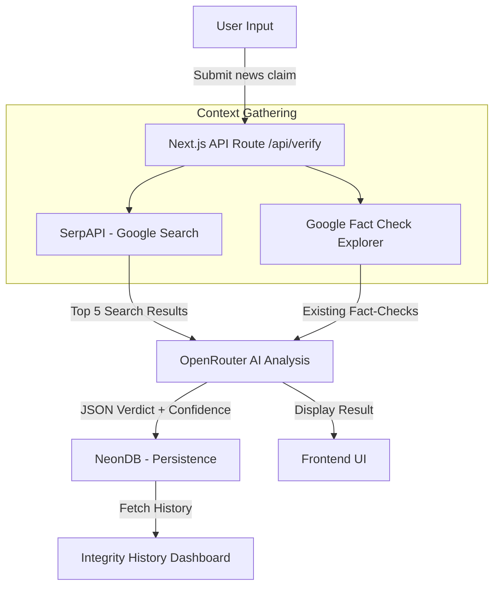

# VeriNews AI — High-Fidelity Information Verification

VeriNews AI is a professional-grade, full-stack application designed to combat misinformation. It leverages advanced AI models and real-time search data to verify claims, provide verdicts, and supply credible sources.

---

## 🚀 Key Features

- **Real-Time Verification**: Cross-references claims against live search results using **SerpAPI**.
- **Deep Fact-Checking**: Integrates with **Google Fact Check Tools** to identify previously debunked news.
- **AI-Powered Analysis**: Utilizes **OpenRouter (Nvidia Nemotron)** for high-fidelity reasoning and verdict generation.
- **Integrity History**: Automatically persists every verification to **NeonDB (PostgreSQL)** for historical tracking.
- **Premium UI/UX**: Built with a modern, glassmorphic design optimized for both desktop and mobile users.
- **Cross-Platform**: Ready for deployment on web and Android (via **Capacitor**).

---

## 🛠️ Tech Stack & Rationale

| Component | Technology | Rationale |
| :--- | :--- | :--- |
| **Frontend** | **Next.js 15 (React 19)** | High performance, server-side rendering for SEO, and modern React features. |
| **Styling** | **Vanilla CSS Variables** | Full control over design tokens, lightweight, and high performance. |
| **Database** | **NeonDB (PostgreSQL)** | Serverless database that scales effortlessly and integrates perfectly with Next.js. |
| **AI Engine** | **OpenRouter (Nvidia Nemotron)** | Access to state-of-the-art LLMs with reliable API performance. |
| **Search API** | **SerpAPI** | Industry-standard reliability for scraping real-time search engine results. |
| **Fact-Check API** | **Google Fact Check Explorer** | Specialized API for matching claims against a database of verified fact-checks. |
| **Mobile Bridge** | **Capacitor** | The most effective way to turn a web codebase into a high-quality native Android app. |

---

## 📊 System Architecture & User Flow

The following diagram explains how data flows from user input to the final verdict:



### 1. Contextual Seeding
When a user submits a claim, the system doesn't rely solely on AI knowledge. It triggers parallel requests to **SerpAPI** to get the latest news context and **Google Fact Check** to see if professional journalists have already analyzed this exact claim.

### 2. Multi-Vector Analysis
The **OpenRouter AI (Nvidia Nemotron)** receives the ground-truth data (search results and official fact-checks) alongside the user's claim. It performs cross-referencing to detect inconsistencies, misleading framing, or outright fabrication.

### 3. Persistent Integrity
Every result is stored in **NeonDB** using serverless SQL. This allows users to track the history of verified claims and ensures that verifications can be audited later if necessary.

---

## 📂 Project Structure

```text
├── android/            # Native Android project files (Capacitor)
├── public/             # Static assets and icons
├── src/
│   ├── app/
│   │   ├── api/        # Serverless backend routes
│   │   │   └── verify/ # POST (verification logic) & GET (history)
│   │   ├── globals.css # Professional design system
│   │   └── page.tsx    # Main verification portal
│   ├── lib/            # Specialized library modules
│   │   ├── ai.ts       # OpenRouter integration
│   │   ├── db.ts       # NeonDB / SQL configuration
│   │   ├── factcheck.ts# Google Fact Check API interaction
│   │   ├── gemini.ts   # Alternative AI engine (Google Gemini)
│   │   └── serpapi.ts  # Google Search scraping
│   └── services/       # Core business logic services
├── capacitor.config.ts # Mobile app configuration
└── package.json        # Dependencies and scripts
```

---

## ⚙️ Getting Started

### Prerequisites
- Node.js (Latest LTS)
- NPM or PNPM

### Environment Variables
Create a `.env.local` file in the root and add the following:
```env
OPENROUTER_API_KEY=your_key
SERP_API_KEY=your_key
GOOGLE_API_KEY=your_key
DATABASE_URL=your_neondb_url
```

### Installation & Run
```bash
# Install dependencies
npm install

# Run the development server
npm run dev

# Build for production
npm run build

# Open mobile project (Android)
npx cap sync android
npx cap open android
```

---

## ⚖️ License
Distributed under the MIT License. See `LICENSE` for more information.

---
*Built with ❤️ by the VeriNews AI Team*
