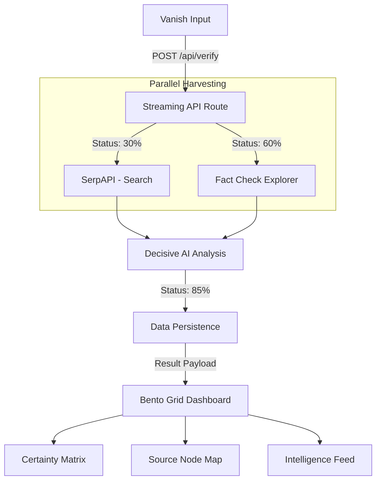

# VeriNews AI — Sleek & Pro Max Verification

VeriNews AI is a premium, high-fidelity information verification platform. It transforms raw news claims into authoritative intelligence reports using multi-vector search, real-time AI analysis, and an immersive dashboard experience.

---

## 🚀 Key Features (Sleek & Pro Max)

- **Real-Time Streaming**: Watch the intelligence engine work in real-time with granular progress markers.
- **Immersive Hero**: Experience a responsive **PixelSnow** particle field and the **Aceternity Vanish Input**.
- **Bento Grid Dashboard**: Results are organized into modular, glassmorphic cards for rapid intelligence scanning.
- **AI-Powered Analysis**: Utilizes **OpenRouter (Nvidia Nemotron)** with strict logical verdict enforcement.
- **Robust Security**: Hardened with **IP-based Rate Limiting** and **Zod Schema Validation**.
- **Historical Integrity**: Every session is persisted to **NeonDB (PostgreSQL)** for auditing.

---

## 🛠️ Modern Tech Stack

| Component      | Technology                    | Rationale                                                             |
| :------------- | :---------------------------- | :-------------------------------------------------------------------- |
| **Framework**  | **Next.js 16 (Turbopack)**    | Blazing fast development and high-performance server components.      |
| **Styling**    | **Tailwind CSS v4**           | CSS-first theme configuration with advanced glassmorphism utilities.  |
| **UI Library** | **Aceternity & React Bits**   | Premium components like `PlaceholdersAndVanishInput` and `PixelSnow`. |
| **Database**   | **NeonDB (Postgres)**         | Serverless database for persisting verification logs.                 |
| **AI Engine**  | **OpenRouter (Nvidia)**       | Decisive AI analysis utilizing the latest LLMs.                       |
| **Security**   | **Zod + Custom Rate Limiter** | Protecting the platform from API abuse and malformed data.            |

---

## 📊 System Architecture & Streaming Flow

The system uses a **ReadableStream** architecture to provide instant feedback to the user:



---

## 📂 Project Structure

```text
├── src/
│   ├── app/
│   │   ├── api/verify/  # Streaming API (POST) & History (GET)
│   │   ├── globals.css  # Tailwind v4 CSS-first theme
│   │   └── page.tsx     # Immersive Bento Dashboard
│   ├── components/
│   │   ├── ui/          # Aceternity Vanish Input
│   │   └── PixelSnow    # React Bits Particle System
│   ├── lib/
│   │   ├── ai.ts        # Defensive AI Response Logic
│   │   ├── rate-limit.ts# IP-based Security Layer
│   │   ├── serpapi.ts   # Real-time Web Search
│   │   └── db.ts        # NeonDB SQL Bridge
├── android/             # Capacitor Mobile Project
└── tailwind.config.mjs  # (Legacy - Replaced by CSS variables)
```

---

## ⚙️ Getting Started

### Environment Variables

`.env.local` required:

```env
OPENROUTER_API_KEY=your_key
SERP_API_KEY=your_key
GOOGLE_API_KEY=your_key
DATABASE_URL=your_postgres_url
```

### Installation

```bash
# Install latest dependencies
npm install

# Run with Turbopack speed
npm run dev

# Mobile sync
npx cap sync android
Distributed under the MIT License. See `LICENSE` for more information.

---
*Built with ❤️ by the Harsh*
```
